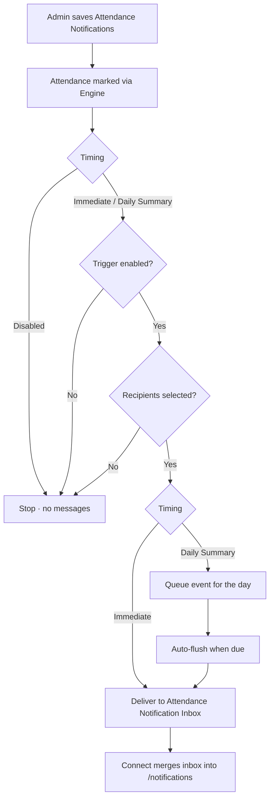

# Attendance Notification Configuration — Workflow

Frontend only (localStorage). No backend.

## Where

**Admin → Settings → Academic → Attendance Notifications**  
(also Academic Management → Settings)

## Configuration

| Area | Values |
|------|--------|
| **Options** | Immediate · Daily Summary · Disabled |
| **Triggers** | Daily Absent · Period Absent |
| **Recipients** | Parent · Student |

**Removed:** Late Entry · Early Exit — Attendance mark sheets only support present / absent / leave, so those triggers could not be emitted from real marking.

## Identity & routing

| Concept | Rule |
|---------|------|
| **Student id on messages** | Canonical attendance id only — `stu:{class}:{section}:{roll}` (e.g. `stu:10:B:14`) |
| **Parent child mapping** | Portal child `C1` → same canonical id via class + section + roll — never filter inbox by `C1` |
| **Stable message ids** | `att-evt:…` / `att-msg:…` / `att-msg-sum:…` (no `Date.now()` collisions) |
| **Connect `/notifications`** | Merges Attendance Notification Inbox into Parent/Student feeds under category **Attendance** |
| **Dashboard alerts** | Same inbox, scoped by canonical student id |

## Workflow

### Steps

1. **Configure** — Admin sets Options, Triggers, Recipients and saves.
2. **Mark attendance** — Teacher (Connect) or Attendance Coordinator (Admin Student Attendance) submits via the shared Attendance Engine.
3. **Emit** — `notifyFromAttendanceSubmit` maps period slots → Period Absent, other slots → Daily Absent.
4. **Gate** — Disabled / missing trigger / no recipients → skip.
5. **Immediate** — messages delivered to Attendance Notification Inbox + Admin outbox.
6. **Daily Summary** — events queued; **auto-flushed** for past dates, and for **today after 16:00 local** (demo). No manual Flush button.
7. **Connect** — Parent/Student `/notifications` and dashboard alerts consume the same inbox (child-scoped).

## Daily Summary — automation limits (no backend)

| What works in demo | What needs backend |
|--------------------|--------------------|
| Auto-flush when inbox is read / Admin panel opens | True end-of-day cron at a fixed institute timezone |
| Auto-flush after emit if the date is already due | Cross-device delivery (Admin origin ≠ Connect origin) |
| Past-date queue drain | Push / email / SMS fan-out |

**Documented gap:** Clock-accurate Daily Summary delivery without a user opening the app requires a backend job (e.g. `rpc_flush_attendance_daily_summary` / Edge cron). Frontend cannot schedule that reliably.

## Key files

| File | Role |
|------|------|
| `notification-types.ts` | Timing · trigger · recipient types |
| `notification-config-store.ts` | Load/save config |
| `notification-flow.ts` | Emit · queue · auto-flush · inbox |
| `AttendanceNotificationConfigPanel.tsx` | Admin Settings UI |
| `apps/connect/.../notification-bridge.ts` | Merge inbox ↔ Parent/Student `/notifications` |
| Teacher `repositories.ts` / Admin MarkPanel | Call `notifyFromAttendanceSubmit` on submit |
