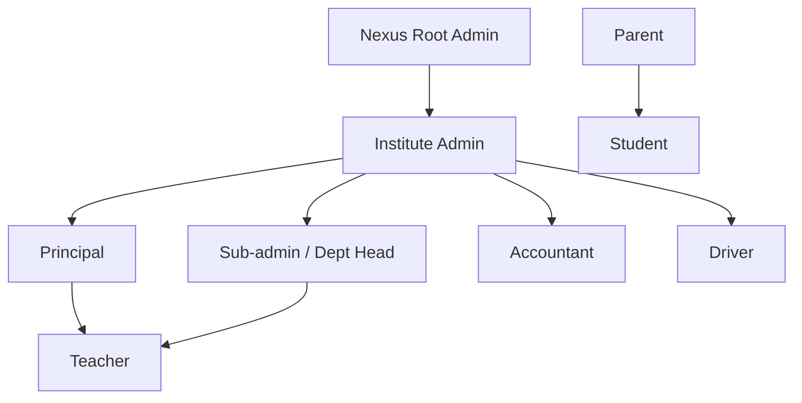
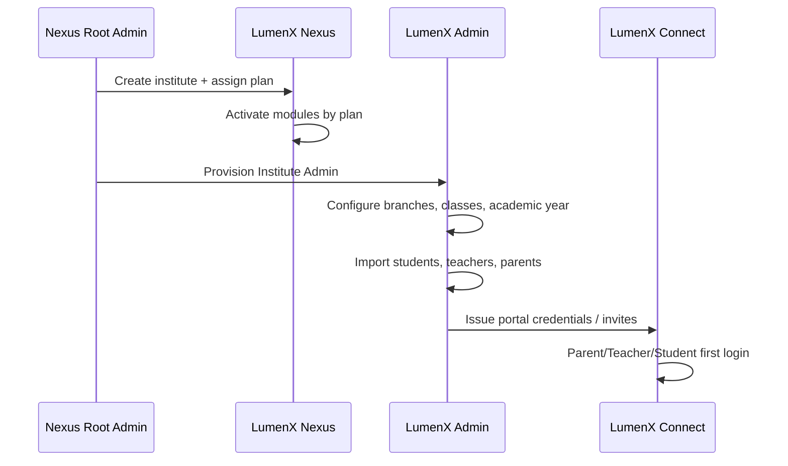

# LumenX Master Documentation

**Version:** 1.0  
**Status:** Living document — ecosystem definition  
**Audience:** Product, engineering, design, and operations  

---

## 1. LumenX Ecosystem Overview

### 1.1 Vision

LumenX is a modular education platform for institutes — connecting administrators, families, teachers, students, and transport operations in one ecosystem. It is designed to scale from a single branch to multi-institute deployments with platform-level governance through **LumenX Nexus**.

### 1.2 Product suite

| Product | Role in ecosystem |
|---------|-------------------|
| **LumenX Nexus** | Platform command center — multi-tenant ops, licensing, analytics, IAM |
| **LumenX Admin** | Institute operations console — day-to-day school management |
| **LumenX Connect** | Unified portal for parents, teachers, and students |
| **LumenX Transport** | Fleet, routes, drivers, and parent-facing transport tracking |

### 1.3 Architecture philosophy

- **Modular by domain** — each capability (Students, Fees, Transport, etc.) is a first-class module with its own lifecycle, permissions, and plan gates.
- **Multi-app, single platform** — apps share types, auth, UI, and data contracts; each app exposes only what its users need.
- **Plan-driven activation** — institutes subscribe to **Core**, **Plus**, or **Max**; modules unlock by plan tier.
- **Tenant isolation** — all institute data is scoped by `Institute` and optionally `Branch`.

### 1.4 Current implementation status (reference)

| Product | Path | Status |
|---------|------|--------|
| LumenX Connect | `apps/connect/` | Runnable UI prototype (mock data) |
| LumenX Admin | `apps/admin/` | Runnable UI prototype (mock data) |
| LumenX Nexus | `apps/nexus/` | Runnable scaffold (Admin-derived; platform differentiation in progress) |
| LumenX Transport | `apps/transport/` | Runnable UI prototype |
| LumenX Website | `apps/website/` | Public marketing site |

### 1.5 Technology direction

React 19, TypeScript, TanStack Start, TanStack Router, shared UI package, Cloudflare Workers deployment, and a centralized database layer with tenant-scoped entities.

---

## 2. Product Overview

### 2.1 LumenX Nexus

**Tagline:** *Institute Intelligence Center*

**Purpose:** Platform-level control for LumenX operators and enterprise institute groups. Nexus governs what modules are active, who can access them, and how institutes perform across the network.

**Primary users:** Nexus Root Admin, platform operations, enterprise institute heads.

**Core capabilities:**

- Multi-institute dashboard and cross-tenant analytics
- Module & plan management (Core / Plus / Max)
- Platform IAM, licensing, and SLA alerting
- Institute onboarding and branch topology
- Policy engine (alerts P0–P3, compliance, audit)
- Storage quotas, permissions matrices, and system health

**Does not replace Admin:** Nexus configures and observes; Admin executes institute operations.

---

### 2.2 LumenX Admin

**Tagline:** *Institute Operations Console*

**Purpose:** Day-to-day management for a single institute (or branch). Admin is the authoritative workspace for staff to manage people, classes, finance, and operations.

**Primary users:** Institute Admin, Principal, Sub-admin, Accountant, front office.

**Core capabilities:**

- Student, teacher, and parent directory management
- Class, section, and timetable administration
- Attendance capture and reporting
- Fees configuration and collection oversight
- Exams, marks, and academic records
- Complaints, announcements, events, notifications
- Admissions pipeline (Plus/Max)
- Careers and certificates (Max)
- Transport route assignment (when Transport module is active)

**Data authority:** Admin writes authoritative institute data; Connect reads scoped views.

---

### 2.3 LumenX Connect

**Tagline:** *Education Ecosystem for Parents, Teachers & Students*

**Purpose:** A single mobile-first portal where end users access only what their role permits — with strict role isolation and multi-child parent support.

**Primary users:** Parent, Teacher, Student.

**Core capabilities:**

- Role-based login (institute → portal → credentials → OTP)
- Parent: multi-child switching, attendance, fees, marks, messages, complaints
- Teacher: class attendance, assignments, timetable, student overview
- Student: timetable, assignments, marks, growth/motivation, profile, ID card
- Notifications, events, sports, and institute announcements (read/interact)
- Parent transport tracking (when Transport module is active)

**Design intent:** Native-app feel, instant navigation, emotionally engaging student experience, airtight role boundaries.

---

### 2.4 LumenX Transport

**Tagline:** *Fleet & Route Intelligence*

**Purpose:** Dedicated product for school transport — routes, vehicles, drivers, live operations, and parent visibility.

**Primary users:** Driver, transport coordinator, Institute Admin, Parent (read-only via Connect).

**Core capabilities:**

- Route and stop management
- Vehicle and driver registry
- Daily trip scheduling and dispatch
- Live tracking and delay alerts
- Parent notifications for pickup/drop
- Incident reporting and compliance logs
- Integration with Admin (assign students to routes) and Connect (parent view)

**Deployment:** Standalone app (`apps/transport`) sharing platform modules and database entities.

---

## 3. User Roles

### 3.1 Role hierarchy



### 3.2 Role definitions

| Role | Primary app | Scope | Description |
|------|-------------|-------|-------------|
| **Nexus Root Admin** | Nexus | Platform | Full cross-tenant access; module licensing, IAM, platform alerts |
| **Institute Admin** | Admin, Nexus (limited) | Institute | Full institute configuration; user provisioning; module ops |
| **Principal** | Admin | Institute / branch | Academic oversight, approvals, analytics, dept management |
| **Teacher** | Connect, Admin (limited) | Class / subject | Attendance, marks, assignments, student interaction |
| **Parent** | Connect | Linked children | Child progress, fees, complaints, transport tracking |
| **Student** | Connect | Self | Timetable, marks, assignments, profile, motivation |
| **Driver** | Transport | Assigned routes | Trip execution, student check-in, incident reports |
| **Accountant** | Admin | Finance | Fees, invoices, reminders, financial reports |

### 3.3 Role × app access matrix

| Role | Nexus | Admin | Connect | Transport |
|------|-------|-------|---------|-----------|
| Nexus Root Admin | Full | Configure | — | Configure |
| Institute Admin | Read | Full | — | Manage |
| Principal | Read | Full | — | View |
| Teacher | — | Limited | Portal | — |
| Parent | — | — | Portal | Track (via Connect) |
| Student | — | — | Portal | — |
| Driver | — | — | — | Operate |
| Accountant | — | Finance modules | — | — |

### 3.4 Authentication model (target)

- Institute-scoped identity with role-based access control (RBAC)
- Server-validated sessions (evolving from current demo localStorage)
- OTP verification for Connect end users
- MFA for Admin and Nexus privileged roles (Max plan)

---

## 4. Plans

Plans control **which modules are available** and **usage limits**. Institutes upgrade without changing apps — modules activate via configuration.

### 4.1 Plan comparison

| Capability | **Core** | **Plus** | **Max** |
|------------|----------|----------|---------|
| **Target** | Small institutes | Growing schools | Enterprise / groups |
| **Students limit** | Up to 500 | Up to 5,000 | Unlimited |
| **Branches** | 1 | Up to 3 | Unlimited |
| **Students, Teachers, Parents** | ✅ | ✅ | ✅ |
| **Classes & Sections** | ✅ | ✅ | ✅ |
| **Attendance** | ✅ | ✅ | ✅ |
| **Notifications** | Basic | ✅ | ✅ |
| **Timetable Builder** | — | ✅ | ✅ |
| **Exams & Marks** | — | ✅ | ✅ |
| **Fees** | — | ✅ | ✅ |
| **Complaints** | — | ✅ | ✅ |
| **Announcements & Events** | — | ✅ | ✅ |
| **Analytics** | — | ✅ | ✅ |
| **Admissions** | — | ✅ | ✅ |
| **Transport** | — | Add-on | ✅ |
| **Careers** | — | — | ✅ |
| **Certificates** | — | — | ✅ |
| **Alerts engine (P0–P3)** | — | — | ✅ |
| **IAM & custom permissions** | — | — | ✅ |
| **Cloud storage quotas** | Basic | Standard | Enterprise |
| **SLA / priority support** | — | — | ✅ |

### 4.2 Plan identifiers (internal)

```text
lumenx.plan.core
lumenx.plan.plus
lumenx.plan.max
```

### 4.3 Module gating

- Nexus **Modules & Plan** UI is the control surface for activation.
- Each module declares `minPlan` in the module registry.
- Downgrade retains data but restricts write access and hides nav entries.

---

## 5. Modules

Each module is a bounded domain with Admin, Connect, Nexus, and/or Transport presentation layers.

### 5.1 Module catalog

| Module | Description | Min plan |
|--------|-------------|----------|
| **Students** | Directory, admissions link, 360° profiles, guardians | Core |
| **Teachers** | Faculty records, workload, assignments | Core |
| **Parents** | Guardian accounts, child linking, portal access | Core |
| **Attendance** | Daily capture, reports, parent visibility | Core |
| **Fees** | Structures, invoices, reminders, payment status | Plus |
| **Exams** | Exam scheduling, marks ingestion, report cards | Plus |
| **Timetable** | Conflict-aware schedule builder | Plus |
| **Transport** | Routes, fleet, drivers, parent tracking | Plus (add-on) / Max |
| **Admissions** | Application pipeline, enrollment workflow | Plus |
| **Careers** | Placement, internships, alumni pathways | Max |
| **Certificates** | Issuance, templates, verification | Max |
| **Complaints** | Case management with SLAs | Plus |
| **Notifications** | Push, email, SMS triggers | Core |
| **Analytics** | Cohort and performance intelligence | Plus |

### 5.2 Supporting platform modules (Admin/Nexus)

| Capability | Maps to module |
|------------|----------------|
| Accounts & Access | IAM (Max) |
| Permissions | IAM (Max) |
| Modules & Plan | Platform config (Nexus) |
| Alerts | Alerts engine (Max) |
| Storage | Infrastructure (Plus+) |
| Settings | Institute config |

### 5.3 Module identifiers (internal)

```text
lumenx.module.students
lumenx.module.teachers
lumenx.module.parents
lumenx.module.attendance
lumenx.module.fees
lumenx.module.exams
lumenx.module.timetable
lumenx.module.transport
lumenx.module.admissions
lumenx.module.careers
lumenx.module.certificates
lumenx.module.complaints
lumenx.module.notifications
lumenx.module.analytics
```

---

## 6. Module Ownership Matrix

**Ownership** = primary app for configuration and authoritative writes. Other apps consume read-scoped or role-specific views.

| Module | Nexus | Admin | Connect | Transport |
|--------|:-----:|:-----:|:-------:|:---------:|
| **Students** | Analytics, licensing | **Primary** | Read (scoped) | Assign to routes |
| **Teachers** | Analytics | **Primary** | Read / self | — |
| **Parents** | Analytics | **Primary** | **Portal** | Track children |
| **Attendance** | Dashboards | **Primary** | Read / submit (teacher) | — |
| **Fees** | Reporting | **Primary** | Read / reminders | — |
| **Exams** | Reporting | **Primary** | Read | — |
| **Timetable** | — | **Primary** | Read | — |
| **Transport** | Licensing, SLA | Configure routes | Parent tracking | **Primary** |
| **Admissions** | Pipeline metrics | **Primary** | Apply (future) | — |
| **Careers** | — | **Primary** | Read (student) | — |
| **Certificates** | — | **Primary** | Download | — |
| **Complaints** | SLA metrics | **Primary** | Submit / track | Incident reports |
| **Notifications** | Policies | **Primary** | Inbox | Driver alerts |
| **Analytics** | **Primary** (cross-tenant) | Institute scope | — | Fleet metrics |
| **IAM / Permissions** | **Primary** | Delegated | — | Driver access |
| **Modules & Plan** | **Primary** | Read | — | — |
| **Alerts (P0–P3)** | **Primary** | Receive | — | Ops alerts |
| **Storage** | Quotas | **Primary** | — | — |

**Legend:** **Primary** = authoritative owner; blank = no direct ownership; named role = significant read/write surface.

---

## 7. High-Level Workflows

### 7.1 Institute onboarding



### 7.2 Student admission (Plus+)

1. Application captured (Admissions module)
2. Review and approval (Principal / Admin)
3. Student record created (Students module)
4. Class and section assignment (Classes)
5. Parent linking and portal invite (Parents + Connect)
6. Fee structure assignment (Fees, if applicable)

### 7.3 Daily attendance

1. Teacher opens Connect → marks class attendance
2. Admin views institute-wide summary and exceptions
3. Parent receives notification for absence (Notifications)
4. Analytics aggregates trends (Admin / Nexus)

### 7.4 Fee reminder

1. Accountant configures fee schedule (Admin)
2. System generates due reminders (Notifications)
3. Parent views balance and history (Connect)
4. Student may trigger reminder to parent (Connect, optional)

### 7.5 Complaint lifecycle

1. Parent or staff submits complaint (Connect or Admin)
2. Case assigned with priority P0–P3
3. Resolution tracked with SLA (Admin)
4. Nexus monitors SLA breaches (Max, Alerts module)

### 7.6 Transport daily trip

1. Admin assigns students to routes (Admin + Transport)
2. Driver receives trip manifest (Transport app)
3. Live tracking and delay detection (Transport)
4. Parent views bus status (Connect)
5. Incidents escalated to Admin and Nexus alerts if critical

### 7.7 Module upgrade (plan change)

1. Nexus Root Admin upgrades institute Core → Plus
2. Module registry unlocks Timetable, Fees, Exams, etc.
3. Admin nav updates automatically
4. Connect surfaces new parent/teacher views
5. No data migration required — gates open on existing tenant

---

## 8. UI/UX Principles

### 8.1 Global design principles

| Principle | Application |
|-----------|---------------|
| **Mobile-first** | Connect and Transport optimized for phones; Admin/Nexus responsive desktop-first |
| **Role isolation** | Users never see another role's navigation or data |
| **Quiet clarity** | Information-dense but calm; avoid visual noise |
| **Instant feel** | Optimistic UI, skeleton states, sub-100ms perceived navigation |
| **Accessible by default** | WCAG-oriented contrast, keyboard nav, semantic HTML |
| **Consistent design system** | Shared `@lumenx/ui` primitives across all apps |

### 8.2 Product-specific UX

**LumenX Connect**

- Single login flow: institute → role → phone → password → OTP
- Parent multi-child switcher always visible in context bar
- Student motivation layer (streaks, goals, encouragement) — engaging but not gamified to distraction
- Bottom-weighted navigation on mobile

**LumenX Admin**

- Command Center dashboard as home — KPIs, activity feed, weak-student signals
- Data tables with inline filters, bulk actions, export
- Modal-driven create flows (admit student, provision account)
- Sidebar grouped by domain: People, Operations, Communications, Intelligence

**LumenX Nexus**

- Cross-institute lens — compare, drill down, act
- Module toggles tied to plan tier with clear upgrade paths
- Alert rule builder with P0–P3 severity
- Platform wordmark: **LUMENX NEXUS**

**LumenX Transport**

- Driver-first: large touch targets, offline-tolerant trip flow
- Map-centric route visualization
- Parent view in Connect: minimal, status-focused (on time / delayed / arrived)

### 8.3 Page title convention

| App | Pattern |
|-----|---------|
| Connect | `{Page} — LumenX Connect` |
| Admin | `{Page} — LumenX Admin` |
| Nexus | `{Page} — LumenX Nexus` |
| Transport | `{Page} — LumenX Transport` |

### 8.4 Tone & voice

- Professional, warm, institute-appropriate
- Plain language for parents; precise language for admin
- Error messages: actionable, never blame the user

---

## 9. Naming Conventions

### 9.1 Product & brand

| Item | Convention | Example |
|------|------------|---------|
| Ecosystem | LumenX | LumenX Ecosystem |
| Products | LumenX {Name} | LumenX Connect |
| Wordmark (sidebar) | UPPERCASE for Admin/Nexus/Transport | LUMENX ADMIN |
| Wordmark (Connect) | Title case | LumenX Connect |

### 9.2 Engineering

| Item | Convention | Example |
|------|------------|---------|
| npm scope | `@lumenx/*` | `@lumenx/ui` |
| Apps | `@lumenx/app-{name}` | `@lumenx/app-connect` |
| Modules | `@lumenx/module-{domain}` | `@lumenx/module-students` |
| Folders | kebab-case | `apps/connect/` |
| React components | PascalCase | `StudentDetailPage.tsx` |
| Routes (TanStack) | file-based | `students.$id.tsx` |
| Wrangler deploy | `lumenx-{app}` | `lumenx-connect` |

### 9.3 Domain & mock data

| Item | Convention |
|------|------------|
| Email domain | `@lumenx.app`, `@lumenx.edu` |
| Demo institute | LumenX Demo Institute |
| Demo academy | LumenX Academy |
| Storage keys (future) | `lumenx:{app}:{key}` |

### 9.4 Git & releases

| Item | Convention |
|------|------------|
| Commits | Conventional Commits (`feat(students): …`) |
| Branches | `feat/module-name-description` |
| Versioning | Semver per app; monorepo tagged releases |

---

## 10. Future Roadmap

### 10.1 Engineering roadmap (architecture)

| Phase | Milestone | Outcome |
|-------|-----------|---------|
| **M1** | Monorepo (`apps/`, `packages/`, `docs/`) | Structural foundation |
| **M2** | `@lumenx/ui` shared design system | Remove 138 duplicate UI files |
| **M3** | `@lumenx/types`, `@lumenx/config`, `@lumenx/auth`, `@lumenx/utils` | Platform contracts |
| **M4** | `@lumenx/database` + entity schema | Persistence layer |
| **M5** | `@lumenx/module-students` pilot | Feature-based architecture proven |
| **M6** | Remaining domain modules (14+) | Full modular monorepo |
| **M7** | `apps/transport` + transport modules | Fourth product live |

### 10.2 Product roadmap

| Horizon | Deliverables |
|---------|--------------|
| **Q1 — Foundation** | Monorepo, shared UI, auth hardening, build CI |
| **Q2 — Data layer** | Database, API, Students/Teachers/Parents modules live |
| **Q3 — Operations** | Attendance, Fees, Exams, Timetable, Notifications |
| **Q4 — Platform** | Nexus licensing UI wired to module registry; Analytics |
| **Year 2** | Transport app, Admissions, Careers, Certificates; mobile apps; SSO |

### 10.3 Integrations (planned)

- SMS / WhatsApp gateways for OTP and alerts
- Payment gateways for Fees (region-specific)
- GPS/telematics for Transport live tracking
- SIS/ERP import-export (CSV, API)
- Government reporting formats (region-specific)

### 10.4 Success metrics

| Metric | Target |
|--------|--------|
| Module activation time | < 5 minutes from Nexus |
| Connect login completion | > 90% success rate |
| Admin task completion | Core flows < 3 clicks |
| Platform uptime | 99.9% (Max SLA) |
| Cross-app type safety | 100% shared `@lumenx/types` |

---

## Document control

| Field | Value |
|-------|-------|
| **Owner** | LumenX Product & Engineering |
| **Last updated** | May 2026 |
| **Next review** | After `@lumenx/ui` extraction (M2) |
| **Related docs** | `docs/migration/PHASE1.md`, root `README.md` |
